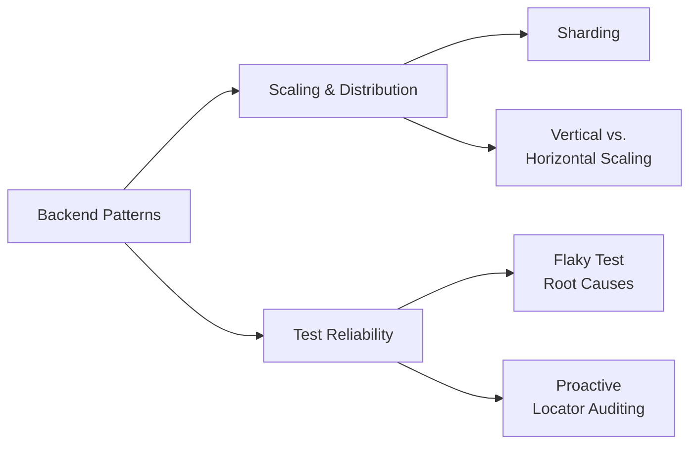

# Backend Patterns


I study system design (currently Frank Kane's *Mastering the System Design Interview* on
Udemy) and ship test-automation work daily. This is where the two collide — short,
opinionated write-ups of patterns I've actually studied or hit in practice, each with a
plain-English analogy, a diagram, and working code, plus an honest note on when *not* to
reach for it. Added incrementally, not written as a tutorial series — a running notebook.



## Scaling & Distribution
| Pattern | What it solves |
|---|---|
| [Sharding](patterns/scaling/sharding.md) | Splitting a workload too big for one worker into parallel, independent slices |
| [Vertical vs. Horizontal Scaling](patterns/scaling/vertical-vs-horizontal-scaling.md) | Adding capacity by upgrading one server vs. adding more of them |

## Test Reliability
| Pattern | What it solves |
|---|---|
| [Flaky Test Root Causes](patterns/testing/flaky-test-root-causes.md) | Diagnosing intermittent E2E/UI test failures instead of retrying past them |
| [Proactive Locator Auditing](patterns/testing/proactive-locator-auditing.md) | Finding locator gaps across a whole screen module before a test ever runs against them |

Every write-up follows the same shape: **TL;DR** (the analogy), **Problem**, **Fix**
(diagram + code), **Hazards**, and **When to use it / When not to** — so you can skim the
first line and know whether the rest is worth reading.

<details>
<summary><strong>Setup</strong> (for me, not a visitor)</summary>

This repo is personal — commits and pushes should only ever go out under my personal
GitHub account, never a work identity. A pre-push hook enforces that (checks
`git config user.email` and the active `gh` account, and refuses to push otherwise). The
expected identity is never hardcoded in this repo — it's read from git config, so it's
never a public file's content. Not enabled by default on a fresh clone — activate it once
with:
```
git config core.hooksPath .githooks
git config --global hooks.personal-email <your-personal-email>
git config --global hooks.personal-gh-user <your-personal-github-username>
```
</details>

## Log
A short diary of each session — the point isn't the content, it's keeping the streak of
showing up going.

- **2026-09-06** — Added Vertical vs. Horizontal Scaling, from Frank Kane's *Mastering the
  System Design Interview* (Udemy). First log entry — starting the habit of noting a line
  here every time a pattern gets added.
- **2026-09-07** — Worked on Appium authentication code; the device got too heavy and got
  stuck, so testing it stalled. Picking it back up tomorrow.
- **2026-09-08** — Added a real-world case study to Sharding: replacing a fixed shard
  count with duration-based dynamic shard planning in a CI regression suite. Also added a
  new pattern, Flaky Test Root Causes, distilled from a day of review fixes across six
  PRs — race conditions, unstable locators, false-confidence assertions, silent retries,
  and shared-state pollution.
- **2026-09-09** — Busy day: 6 merged, new coverage added, 4 previously-broken tests
  confirmed fixed, two flaky UI interactions tracked down. Extended Sharding with the
  shard-floor experiment's real result, and Flaky Test Root Causes with two more locator
  fixes plus a note on capturing failure artifacts (screenshot + snapshot) to diagnose
  failures faster.
- **2026-09-10** — Heavy day: 7 merged, 3 more open for review, a new proactive
  locator-audit tool shipped (and then fixed after it under-reported gaps). Added a new
  pattern, Proactive Locator Auditing, and extended Flaky Test Root Causes with two new
  hazards: infra outages and stale specs both look like flaky tests but aren't.
- **2026-09-10** — Restructured the repo into categories (Scaling & Distribution, Test
  Reliability) with a visual map, since a flat table and wall of text wasn't doing the
  content justice..

## License
MIT — see [LICENSE](LICENSE)
