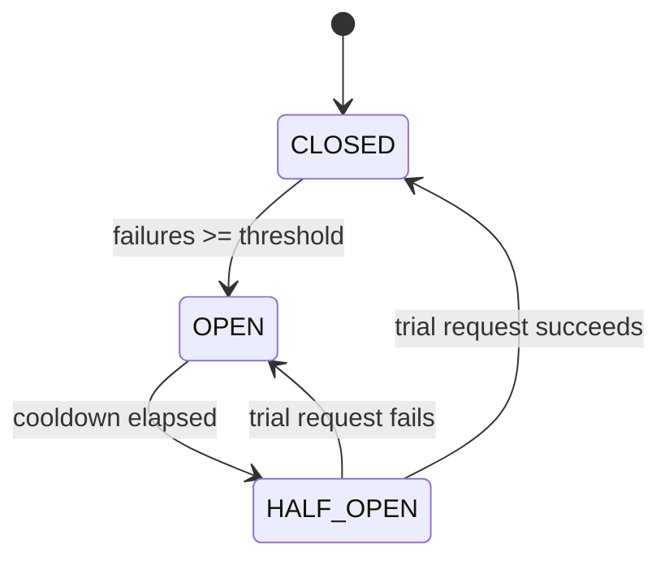

# Circuit Breaker

**TL;DR:** if a household appliance keeps short-circuiting, the breaker in your fuse box
trips and cuts power to it — instead of letting it keep drawing current and starting a
fire. Same idea for a failing dependency: stop calling it for a while instead of letting
it take your service down too.

**Problem:** a downstream dependency (a third-party API, a slow DB replica) starts
failing or timing out. Without protection, every incoming request still tries to call it,
piles up waiting on the timeout, and exhausts your own thread/connection pool — a single
failing dependency takes down the whole service.

**Fix:** track recent failures per dependency. Once failures cross a threshold, "open" the
circuit: fail fast immediately (no network call) for a cooldown period. After the cooldown,
allow a single trial request through ("half-open") — if it succeeds, close the circuit and
resume normal traffic; if it fails, reopen it and restart the cooldown.



```python
import time
import threading
from enum import Enum, auto

class State(Enum):
    CLOSED = auto()
    OPEN = auto()
    HALF_OPEN = auto()

class CircuitOpenError(Exception):
    pass

class CircuitBreaker:
    def __init__(self, failure_threshold: int = 5, cooldown_seconds: float = 30):
        self.failure_threshold = failure_threshold
        self.cooldown_seconds = cooldown_seconds
        self._state = State.CLOSED
        self._failure_count = 0
        self._opened_at: float | None = None
        self._lock = threading.Lock()

    def _current_state(self) -> State:
        if self._state == State.OPEN:
            elapsed = time.monotonic() - self._opened_at
            if elapsed >= self.cooldown_seconds:
                self._state = State.HALF_OPEN
        return self._state

    def call(self, fn, *args, **kwargs):
        with self._lock:
            state = self._current_state()
            if state == State.OPEN:
                raise CircuitOpenError("Circuit is open, failing fast")

        try:
            result = fn(*args, **kwargs)
        except Exception:
            with self._lock:
                self._failure_count += 1
                if self._state == State.HALF_OPEN or self._failure_count >= self.failure_threshold:
                    self._state = State.OPEN
                    self._opened_at = time.monotonic()
            raise
        else:
            with self._lock:
                self._failure_count = 0
                self._state = State.CLOSED
            return result
```

Usage:

```python
inventory_service_breaker = CircuitBreaker(failure_threshold=5, cooldown_seconds=30)

def get_stock_level(sku: str) -> int:
    try:
        return inventory_service_breaker.call(call_inventory_api, sku)
    except CircuitOpenError:
        return cached_stock_level(sku)  # degrade gracefully instead of hanging
```

## When to use it
- Calls to any external service or dependency that can be slow or flaky, especially where
  a fallback (cache, default value, degraded mode) is available.

## When not to
- Don't wrap calls to your own database if there's no fallback anyway — failing fast just
  turns a slow error into a fast one; it doesn't help unless there's somewhere else to go.
- A single-process breaker doesn't share state across instances, so under load each
  instance opens independently — for a shared view of a dependency's health across a
  fleet, the state needs to live somewhere shared (Redis) instead.
