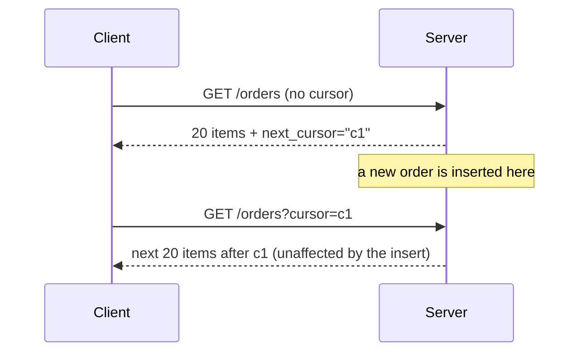

# Cursor-Based Pagination

**TL;DR:** a cursor is a bookmark, not a page number. "Give me the 20 rows after this
bookmark" stays correct even if rows get added or removed elsewhere in the book. "Give me
page 3" breaks the moment the book's contents shift, because page 3 doesn't mean the same
thing anymore.

**Problem:** offset pagination (`LIMIT 20 OFFSET 40`) breaks when rows are inserted or
deleted between page requests — a row can shift from page 3 to page 2 mid-scroll, so the
client either sees it twice or misses it entirely. It also gets slower on large tables,
since the database still has to scan and discard every skipped row.

**Fix:** instead of an offset, the client passes an opaque cursor derived from the last
row it saw. The next page is a `WHERE` clause anchored on that cursor, which stays stable
regardless of concurrent inserts/deletes elsewhere in the table.



```python
import base64
import json
from dataclasses import dataclass

@dataclass
class Page:
    items: list
    next_cursor: str | None

def encode_cursor(created_at: str, id_: str) -> str:
    raw = json.dumps({"created_at": created_at, "id": id_})
    return base64.urlsafe_b64encode(raw.encode()).decode()

def decode_cursor(cursor: str) -> dict:
    raw = base64.urlsafe_b64decode(cursor.encode()).decode()
    return json.loads(raw)

def fetch_page(db, cursor: str | None, page_size: int = 20) -> Page:
    """
    Assumes rows are ordered by (created_at DESC, id DESC) — a compound key is needed
    because created_at alone isn't unique, so ties would break pagination.
    """
    if cursor is None:
        rows = db.query(
            "SELECT * FROM orders ORDER BY created_at DESC, id DESC LIMIT %s",
            [page_size + 1],
        )
    else:
        pos = decode_cursor(cursor)
        rows = db.query(
            """
            SELECT * FROM orders
            WHERE (created_at, id) < (%s, %s)
            ORDER BY created_at DESC, id DESC
            LIMIT %s
            """,
            [pos["created_at"], pos["id"], page_size + 1],
        )

    has_more = len(rows) > page_size
    items = rows[:page_size]
    next_cursor = (
        encode_cursor(items[-1]["created_at"], items[-1]["id"]) if has_more else None
    )
    return Page(items=items, next_cursor=next_cursor)
```

Usage:

```python
@app.get("/orders")
def list_orders(cursor: str | None = None):
    page = fetch_page(db, cursor)
    return {"items": page.items, "next_cursor": page.next_cursor}
```

## When to use it
- Any feed/list endpoint over a table that changes while users are scrolling through it
  (orders, notifications, activity feeds) — which is most real-world "infinite scroll" APIs.

## When not to
- If callers genuinely need "jump to page 7" (not just next/previous), offset pagination
  or a hybrid approach is simpler — cursors don't support random access, only sequential
  walking from where you are.
