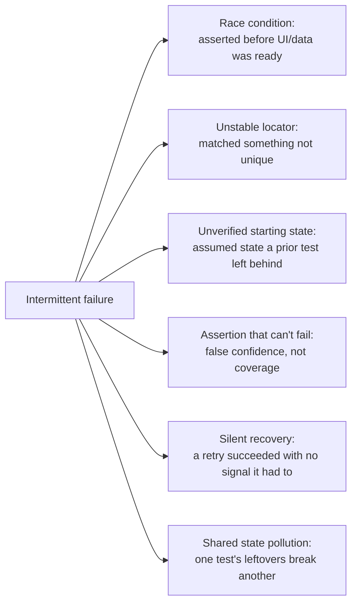

# Flaky Test Root Causes

**TL;DR:** a flaky test is a photographer who sometimes gets the shot and sometimes
doesn't — the subject didn't change, the timing or the framing did. Intermittent E2E/UI
test failures almost never mean "tests are unreliable, ignore it." They trace back to a
short, repeatable list of causes, each with its own fix. Find which one it actually is
before reaching for a retry.

**Problem:** a UI/E2E test passes most runs and fails occasionally, with no code change
that explains the difference. Left alone, this is corrosive: failures get treated as
noise, people rerun until green, and a real regression eventually hides behind the same
"probably just flaky" reflex that was trained by all the false alarms before it.

**Fix:** work through the test the way you'd interrogate an unreliable witness — not "is
it lying," but "what is it actually looking at, and when." Six causes account for most
flakiness in practice:



**Race conditions.** Waiting for a shallow readiness signal (a header rendered) instead of
the content the assertion actually depends on (the data grid rendered) is the single most
common cause. The fix is almost always to wait on the specific thing being asserted, not a
proxy for "the screen loaded":

```ts
// Flaky: app bar renders long before the grid's async data does
await expect(appBar).toBeDisplayed()
await expect(monthGrid).toBeDisplayed()  // races the data fetch

// Fixed: wait on the thing that actually gates the assertion
await monthGrid.waitForDisplayed({ timeout: 5000 })
await expect(monthGrid).toBeDisplayed()
```

The same root cause shows up as "assert too early" against anything async — a filter
re-fetch, a debounced search, a dialog transition. Wait out the specific async operation,
not a fixed sleep and not an unrelated element.

**Unstable locators.** A locator that matches loose, non-unique text (a screen title, a
generic label) breaks the moment a second element shares that text — or matches the wrong
one silently instead of failing loudly. Anchor on the most specific stable identifier
available (a `testID`, a unique control), and when text is unavoidable, match the most
specific text on screen (a subtitle, a field label) rather than something reused across
screens. Two real instances of this: a tap on a repeated list-item card, and a tap on a
generically-labeled "open detail" button — both were flaking because the locator matched
whichever matching element happened to render first, not necessarily the right one.

Sometimes this isn't fixable from the test side at all — the screen simply doesn't expose
a stable identifier for the element you need. When that's the case, the fix is to ask
whoever owns that screen to add one (a `testID`), not to keep tightening a text-based
locator that will break again the next time the copy changes.

Finding these one spec at a time is slow and leaves gaps you only discover when a test
breaks — see [Proactive Locator Auditing](proactive-locator-auditing.md) for finding them
before that happens.

**Unverified starting state.** A scenario that assumes the state a previous step or a
previous test left behind is one code change away from silently testing nothing. Make the
test re-establish the state it needs explicitly (re-enter the screen, re-seed the data it
reads) rather than trusting whatever the test runner happened to leave in place.

**Assertions that can't actually fail.** An assertion that would pass no matter what the
system under test did isn't coverage, it's a false sense of coverage — worse than no
assertion, because it hides the gap. When reviewing a test, ask what change to the app
would make this specific assertion fail; if the answer is "none," delete it.

**Silent recovery.** A transient failure that gets retried and recovers, with nothing
logged, is indistinguishable in the logs from a run that never had a problem. That hides
real degradation until the retries stop being enough:

```ts
async function callWithRetry(fn, maxAttempts = 3) {
  for (let attempt = 1; attempt <= maxAttempts; attempt++) {
    try {
      return await fn()
    } catch (err) {
      if (attempt === maxAttempts) throw err
      // the recovery itself is the signal worth keeping — a run that
      // "passed" only because attempt 2 worked is not the same as a
      // clean run, and should be visible as such
      console.warn(`attempt ${attempt} failed, retrying:`, err.message)
    }
  }
}
```

**Shared state pollution.** A test that mutates shared data (a shared account, a shared
environment) and doesn't clean up after itself passes on its own and fails whichever
unrelated test runs next and happens to notice the leftover junk. Two habits prevent this:
send the minimal mutation the scenario actually needs (a request that only touches the
field it's testing is less likely to have a side effect worth cleaning up), and clean up
anything a scenario creates in shared state before it ends.

**Bonus: capture more than a pass/fail on failure.** None of the six causes above are
faster to diagnose than they are to see. Have the runner grab a screenshot and a page
snapshot automatically whenever a test fails — instead of guessing which of the six
causes applies from a stack trace alone, you can look at the actual screen/DOM state at
the moment it failed. This doesn't fix flakiness by itself, but it collapses the time
between "a test failed" and "I know which of the causes above this is."

## Hazards worth knowing before you ship this
- **Not everything intermittent is a test problem.** A failure that recurs consistently
  under specific conditions (not random) is usually a real bug wearing a "flaky" costume —
  chasing it as a locator or timing issue instead of reproducing and fixing the underlying
  behavior just re-hides the regression.
- **A blanket retry is a bandage, not a diagnosis.** Retrying a failed test until it
  passes makes the symptom go away without identifying which of the six causes above was
  responsible — the same failure mode will keep costing CI time and will eventually stop
  being maskable by a retry.
- **Fixing the wrong cause can look like it worked.** A longer fixed sleep after a race
  condition, or a broader locator after an unstable one, often makes the test pass again
  in CI while leaving the actual gap (a missing explicit wait, a non-unique match) intact
  for the next similar test to hit.
- **An infra outage isn't a flaky test either.** A dependency (a backend deploy, a shared
  environment) being briefly unavailable produces the same red run as any of the six
  causes above, but the fix is neither a retry nor a root-cause hunt in the test — it's
  recognizing the window and attributing the failure to the outage, not the suite. Treating
  every red run as "the test's fault" trains the same "probably flaky, ignore it" reflex
  the whole point of this list is to avoid.
- **A spec that asserts removed behavior isn't flaky — it's stale.** When a product
  deliberately changes or removes a behavior, any spec still asserting the old behavior
  will fail consistently, not intermittently, and no amount of locator or timing fixes
  will make it pass again. That's a signal to update or delete the spec, not debug it.

## When to use it
- A test fails intermittently with no corresponding code change — work through this list
  before assuming the test itself is just "flaky" and needs a retry or a longer timeout.

## When not to
- A test that fails the same way every time isn't flaky — that's a real bug or a real
  test-writing mistake, and it needs a root-cause fix, not anything on this list.
