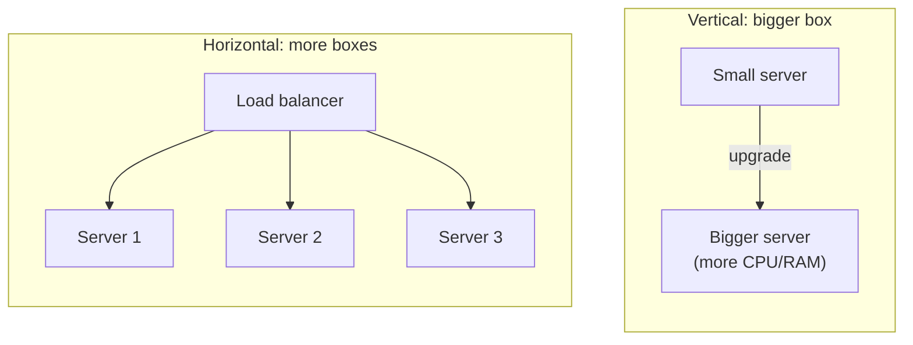

# Vertical vs. Horizontal Scaling

**TL;DR:** vertical scaling is buying one bigger delivery truck. Horizontal scaling is
buying more trucks of the same size. A bigger truck eventually stops being buildable (or
affordable); adding more trucks keeps working as long as the depot can route packages to
whichever truck is free.

**Problem:** a single server is running out of headroom — CPU, memory, or throughput —
and requests are slowing down or failing. You need more capacity, and there are two
structurally different ways to get it.

**Fix:**

- **Vertical scaling (scale up):** replace the server with one that has more CPU, RAM,
  or disk. No architecture changes — the app doesn't know it's running on bigger
  hardware.
- **Horizontal scaling (scale out):** add more servers running the same app, and put a
  load balancer in front to spread requests across them.



Horizontal scaling only works if any server can handle any request — which means the
servers must be stateless. Anything that needs to persist between requests (sessions,
uploaded files, in-progress job state) has to live outside the server, in something all
of them share:

```python
# Stateful — breaks under a load balancer: user's session only exists on
# whichever server happened to handle their login.
sessions = {}  # in-memory, local to this process

def handle_login(user_id, session_id):
    sessions[session_id] = user_id  # lost if the next request hits a different server

# Stateless — any server can serve any request, because the session lives
# in a shared store instead of process memory.
import redis
r = redis.Redis(host="shared-redis", port=6379)

def handle_login_stateless(user_id, session_id):
    r.set(f"session:{session_id}", user_id)
```

## Hazards worth knowing before you ship this
- **Vertical scaling has a ceiling.** At some point there is no bigger machine to buy, or
  the cost curve stops being linear — the biggest instance types cost disproportionately
  more per unit of CPU/RAM than mid-size ones.
- **Vertical scaling usually means downtime.** Resizing a server commonly means stopping
  it, changing its specs, and restarting it — a brief outage unless the platform supports
  live resizing.
- **Horizontal scaling doesn't work for free.** It requires the app to be stateless (or
  to externalize state) and a load balancer to distribute traffic. Retrofitting
  statelessness into an app that was built assuming a single server is real work, not a
  config change.
- **More servers means more coordination problems.** Cache invalidation, distributed
  locking, and consistency across nodes are all costs horizontal scaling introduces that
  a single bigger box never had to deal with.

## When to use it
- **Vertical scaling:** early on, or for workloads with hard-to-parallelize state (a
  single primary database, for example) — it's the fastest way to buy headroom with zero
  architecture change.
- **Horizontal scaling:** once you're approaching the ceiling on a single node, or need
  redundancy (one server dying shouldn't take the whole service down). This is the
  approach that scales further — it has no real upper bound, since capacity grows by
  adding boxes rather than by finding a bigger one.

## When not to
- Don't reach for horizontal scaling before the app is stateless — adding more servers to
  an app that keeps local state just produces inconsistent behavior depending on which
  server a request lands on.
- Don't vertically scale as a long-term strategy for a workload that's still growing —
  it buys time, not a ceiling-free path.

*Notes from Frank Kane's "Mastering the System Design Interview" (Udemy).*
