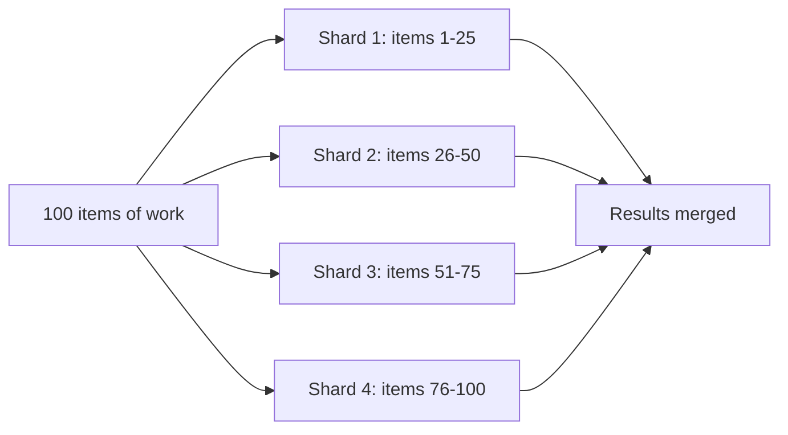

# Sharding

**TL;DR:** one librarian re-shelving the entire library alone takes all day. Split the
shelves into four sections and give each librarian one section — now it takes roughly a
quarter of the time, as long as no section is a lot bigger than the others. Sharding is
that idea applied to any workload too big for one worker: split it into N independent
slices and run them in parallel.

**Where I ran into this:** an Appium mobile test suite running serially on one emulator
started failing intermittently as the suite grew — not real bugs, just the single runner
buckling under load and producing flaky, inconsistent results. Splitting the same suite
into shards running on separate runners in parallel didn't just make it faster; each
shard carried a lighter, more predictable load, and the flakiness disappeared. A good
reminder that sharding isn't only a throughput fix — an overloaded single worker can
degrade in ways that look like bugs, and spreading the load out fixes both problems at once.

**Problem:** a single worker — a database, a CI runner, a batch job — is handling
everything serially, and the work keeps growing. Eventually one worker isn't enough:
either it can't hold all the data, or it takes too long to get through all the work in
the time you have.

**Fix:** partition the work into N shards using a rule that's cheap to compute and
deterministic (the same input always maps to the same shard), and run each shard
independently. Two common flavors:

- **Data sharding** (databases): each row is routed to a shard by a key, usually
  `hash(key) % shard_count`, so reads/writes for that key always go to the same shard.
- **Workload sharding** (batch jobs, CI test suites): a fixed list of work items is split
  into N contiguous chunks, and each chunk runs on its own worker.



Data sharding, keyed by hash:

```python
import hashlib

def shard_for_key(key: str, shard_count: int) -> int:
    digest = hashlib.sha256(key.encode()).hexdigest()
    return int(digest, 16) % shard_count

# order "user_42" always resolves to the same shard, so all of that user's
# rows land on one node and can be queried without a cross-shard fan-out.
shard_for_key("user_42", shard_count=4)
```

Workload sharding, splitting a fixed list into contiguous blocks (the same arithmetic
test runners and batch frameworks use to split N items across T workers):

```python
def split_into_shards(items: list, shard_count: int) -> list[list]:
    n = len(items)
    per_shard = max(round(n / shard_count), 1)
    shards = [items[i : i + per_shard] for i in range(0, n, per_shard)]
    # rounding can produce more chunks than shard_count when n is small
    # relative to shard_count -- merge any overflow into the last real shard
    while len(shards) > shard_count:
        shards[-2].extend(shards[-1])
        shards.pop()
    return shards
```

## Hazards worth knowing before you ship this
- **Rounding can create an empty shard.** `round(n / t)` rounding up means a shard can end
  up with zero items even though `shard_count <= item_count` looks safe on paper. Guard
  for "did every shard get at least one item" explicitly rather than trusting the input
  sizes to make it impossible.
- **The split must be deterministic and stable.** If the underlying list isn't sorted the
  same way every time, two independent workers slicing "the same" list can disagree on
  which items belong to which shard.
- **Shared external state needs to be pinned once, upstream.** If every shard
  independently resolves something that can change between shard starts (the current
  build to test against, a "latest" config value), different shards can end up testing
  against different versions and the overall result becomes meaningless. Resolve it once
  before the shards start, then hand every shard the same pinned value.
- **Uneven shards don't fully parallelize.** If one shard's slice takes much longer than
  the others (data isn't uniformly distributed, or work items vary a lot in cost), your
  wall-clock time is bounded by the slowest shard, not the average — 4x the workers rarely
  means a clean 4x speedup in practice.

## When to use it
- A single node is close to (or past) its capacity for data volume, throughput, or wall-clock
  time, and the work is naturally divisible with little or no cross-shard coordination needed.

## When not to
- If most operations need to touch data across many shards anyway (heavy joins/aggregations
  spanning keys), sharding adds coordination cost without removing the bottleneck — look at
  read replicas, caching, or a bigger single node first.
