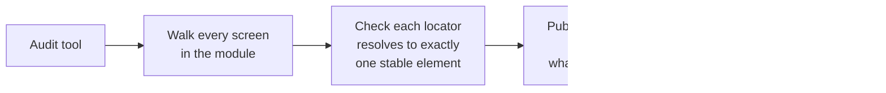
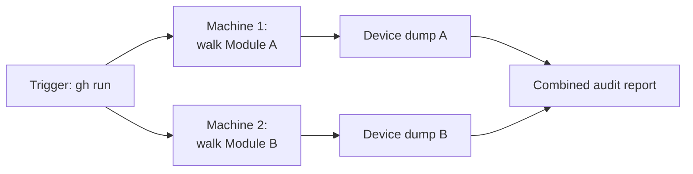

# Proactive Locator Auditing

**TL;DR:** finding a broken locator when its test fails is like finding a leak because the
ceiling stained — technically it works, but you waited for damage to happen first. Walking
every screen and checking every locator resolves to exactly one stable element, in one
pass, finds the same gaps before a single test ever runs against them.

**Problem:** locator gaps in a UI/E2E suite are normally discovered reactively — a test
runs, a locator doesn't resolve cleanly, the test fails or flakes, and only then does
anyone find out that screen's coverage had a hole. For a suite covering many screens, that
means gaps sit undiscovered for however long it takes someone to happen to write or run a
test against that exact screen.

**Fix:** instead of discovering gaps one spec at a time, build a standalone audit pass
that walks an entire screen module up front:



The audit doesn't need to run any test assertions — it only needs to attempt every
locator the suite would use and record what happened:

```ts
async function auditScreenModule(screens: ScreenLocatorMap): Promise<AuditReport> {
  const results: AuditResult[] = []
  for (const [screenName, locators] of Object.entries(screens)) {
    await navigateTo(screenName)
    for (const [name, locator] of Object.entries(locators)) {
      const matches = await $$(locator).length
      results.push({
        screen: screenName,
        locator: name,
        status: matches === 1 ? "ok" : matches === 0 ? "missing" : "ambiguous",
        matchCount: matches,
      })
    }
  }
  // a device dump of every result -- not just the failures -- is what makes this
  // trustworthy: a screen with zero locators checked looks identical to a screen
  // with 100% coverage unless you can see it was actually reached
  return { results, screensReached: Object.keys(screens).length }
}
```

**Where I ran into this:** the first version walked every screen in one process, and once
the app had enough modules that started to matter — waiting on one machine to plod through
everything serially felt like exactly the mistake [Sharding](../scaling/sharding.md) already warns
about. So instead of one job walking the whole app, I split it by module and kicked off a
`gh run` per machine — one module per worker instead of one worker doing all of them in
sequence. Two modules on two machines finishes in roughly the time of the slower one
alone, not the sum of both. Same shard-count-vs-wall-clock tradeoff as Sharding, just
showing up in audit time instead of test-suite time.



## Hazards worth knowing before you ship this
- **The audit tool itself needs the same rigor as the tests it's checking.** An audit that
  silently skips a screen it couldn't reach, or miscounts "1 match" as success without
  checking it's the *right* element, gives false confidence — worse than no audit, because
  it looks like coverage that isn't there. This is "assertions that can't actually fail"
  ([Flaky Test Root Causes](flaky-test-root-causes.md)) wearing a different hat: verify the
  audit tool's own reporting is trustworthy before trusting its output.
- **A clean audit isn't proof a locator behaves correctly under real conditions.** Matching
  exactly one element in a static walk doesn't guarantee that element is stable once async
  state, animations, or dynamic lists are involved — the audit finds locators that are
  *structurally* broken, not every way a locator can flake.

## When to use it
- Before writing new coverage for a screen module, or periodically across an existing
  suite, to find locator gaps proactively instead of waiting for a flaky run to surface
  them one at a time.

## When not to
- Don't treat a passing audit as a substitute for actually running the tests — it checks
  that locators resolve, not that the scenarios built on them are correct.
