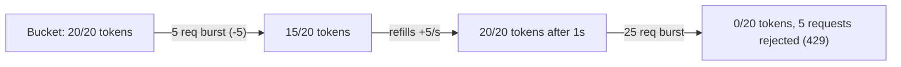

# Token Bucket Rate Limiter

**TL;DR:** think of a bucket that holds a fixed number of tokens and slowly refills, drip
by drip. Every request spends a token. If the bucket's empty, you have to wait for it to
refill. You can spend a burst of saved-up tokens all at once, but you can never out-spend
the refill rate for long.

**Problem:** you need to cap how many requests a client can make per second/minute, but a
hard "N requests per fixed window" limiter unfairly rejects bursts even when the client's
average rate is well within budget (and it has a bad edge case at window boundaries, where
a client can send 2x the limit by timing requests around the window reset).

**Fix:** each client has a bucket that holds up to `capacity` tokens and refills at
`refill_rate` tokens/second. A request costs one token; if the bucket is empty, the
request is rejected (or queued). This allows short bursts up to `capacity` while
enforcing the average rate over time.



```python
import time
import threading

class TokenBucket:
    def __init__(self, capacity: int, refill_rate: float):
        self.capacity = capacity
        self.refill_rate = refill_rate  # tokens added per second
        self.tokens = float(capacity)
        self.last_refill = time.monotonic()
        self._lock = threading.Lock()

    def _refill(self):
        now = time.monotonic()
        elapsed = now - self.last_refill
        self.tokens = min(self.capacity, self.tokens + elapsed * self.refill_rate)
        self.last_refill = now

    def try_consume(self, cost: int = 1) -> bool:
        with self._lock:
            self._refill()
            if self.tokens >= cost:
                self.tokens -= cost
                return True
            return False


class RateLimiter:
    """Per-client rate limiting, e.g. keyed by API key or user id."""

    def __init__(self, capacity: int, refill_rate: float):
        self.capacity = capacity
        self.refill_rate = refill_rate
        self._buckets: dict[str, TokenBucket] = {}
        self._lock = threading.Lock()

    def _bucket_for(self, client_id: str) -> TokenBucket:
        with self._lock:
            if client_id not in self._buckets:
                self._buckets[client_id] = TokenBucket(self.capacity, self.refill_rate)
            return self._buckets[client_id]

    def allow(self, client_id: str) -> bool:
        return self._bucket_for(client_id).try_consume()
```

Usage as FastAPI middleware-style dependency:

```python
limiter = RateLimiter(capacity=20, refill_rate=5)  # burst of 20, sustained 5 req/s

@app.post("/expensive-endpoint")
def handler(request: Request):
    client_id = request.headers["x-api-key"]
    if not limiter.allow(client_id):
        raise HTTPException(status_code=429, detail="Rate limit exceeded")
    ...
```

## When to use it
- Public-facing or per-tenant APIs where you want to protect capacity while still
  tolerating natural burstiness (a client loading a dashboard fires several requests at once).

## When not to
- The in-memory version above only works for a single process — behind multiple app
  instances you need the bucket state in something shared (Redis, e.g. via a Lua script
  for atomicity), otherwise each instance enforces the limit independently and the
  effective limit becomes `limit * instance_count`.
